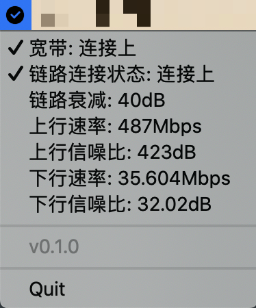

# otecstar

Simple network status monitor for OTECStar devices.

# What

Some ISPs install OTECStar devices for users to access their internet service. However, either their service sucks, or these devices suck, the Internet connection is not stable (sometimes not usable at all), so I need a simple way to know whether I'm currently connected or not.

# How

## To build

```shell script
go run build.go build
```

If you are on macOS, this will build for both macOS and Windows, resulting in `otecstar.app` for macOS and `OTECStar.exe` for Windows.

## To config

```shell script
cp config_sample.ini config.ini
```

And edit `config.ini`, replace router IP, username, password and your desired refresh interval.

And then move the `config.ini` to:

- `~/.config/otecstar/config.ini` on macOS
- `%USERPROFILE%\otecstar\config.ini` on Windows

## To run

Well, you just double click on the built bundle.

## How does it look like?



# License

GPL-3.0.

# Credits

- Thanks [RemixIcon](https://github.com/Remix-Design/remixicon/) for their awesome icons;
- These icons are converted to Go source code via the [2goarray](https://github.com/cratonica/2goarray) tool;
